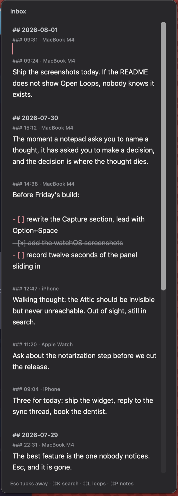
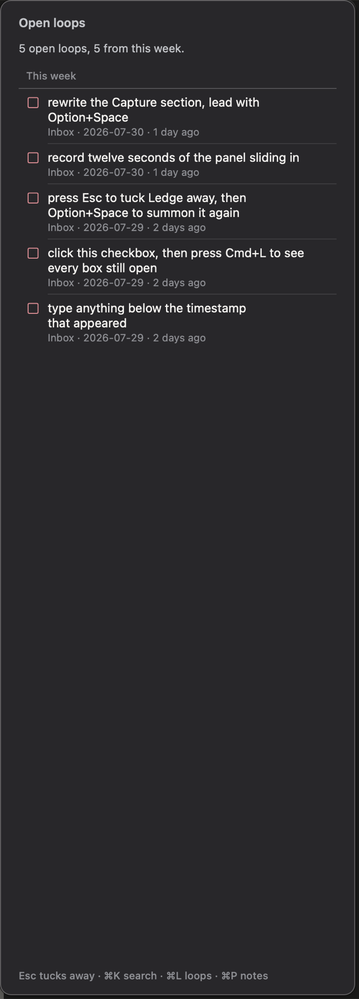
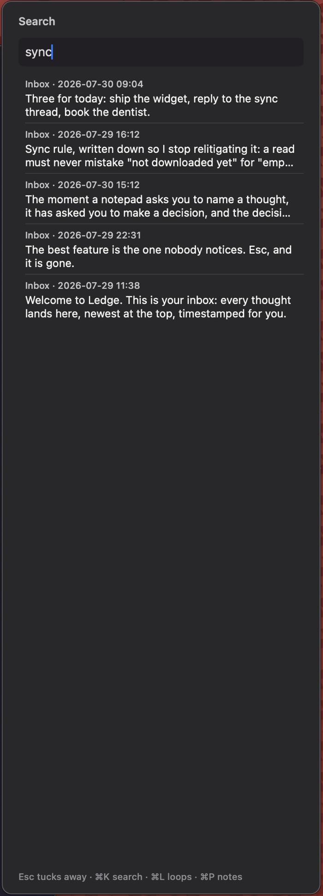
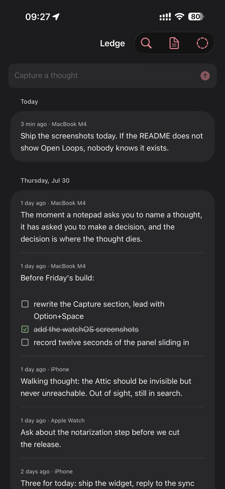
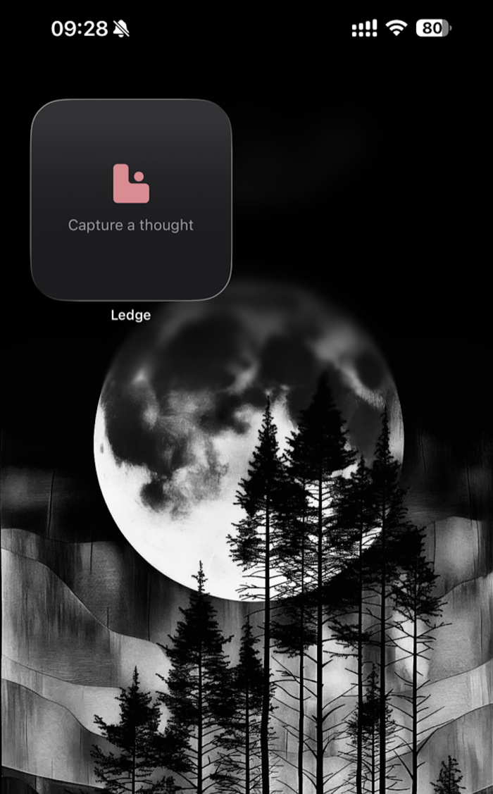
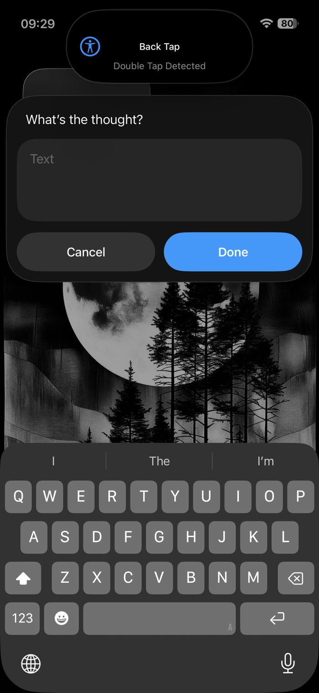
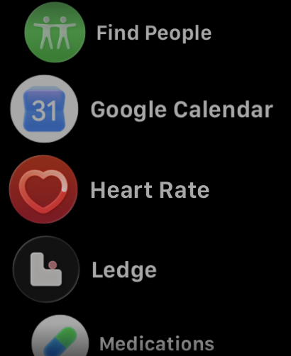
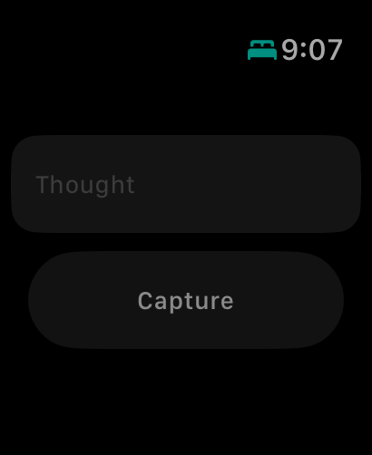

<p align="center">
  <picture>
    <source media="(prefers-color-scheme: dark)"  srcset="design/github/readme-banner-dark-1400x400.png">
    <source media="(prefers-color-scheme: light)" srcset="design/github/readme-banner-light-1400x400.png">
    
  </picture>
</p>

<h1 align="center">Ledge</h1>

<p align="center"><b>An ADHD-first sidebar notepad for Mac, iPhone, iPad, and Apple Watch. Free, open source, local only.</b></p>

<p align="center">
  
  
  
  
  <a href="LICENSE"></a>
</p>

## What it does

- Slides in from the edge of the screen on one hotkey, cursor already blinking on a fresh timestamped entry.
- Saves every thought as plain Markdown in a folder you own.
- Syncs across Mac, iPhone, iPad, and Apple Watch through iCloud Drive, with no account.
- Captures from Siri, Shortcuts, and the Watch, so a thought lands even when the app is not open.
- Resurfaces unchecked items instead of letting them disappear.
- Asks for no filing decisions: no titles, no folders, no tags, no streaks.

## Screenshots

<table>
<tr>
<td width="33%" align="center">
<br>
<sub><b>The sidebar.</b> Option+Space, and the cursor is already sitting on a fresh timestamped entry. Every capture carries the device it came from.</sub>
</td>
<td width="33%" align="center">
<br>
<sub><b>Open Loops, Cmd+L.</b> Every unchecked box you ever wrote, grouped by age, so nothing quietly disappears.</sub>
</td>
<td width="33%" align="center">
<br>
<sub><b>Search, Cmd+K.</b> Fuzzy and recency weighted, across every day and every device. No folders to remember.</sub>
</td>
</tr>
</table>

<table>
<tr>
<td width="33%" align="center">
<br>
<sub><b>iPhone.</b> The same inbox, the same file. Entries from the Mac and the Watch are already sitting there.</sub>
</td>
<td width="33%" align="center">
<br>
<sub><b>Home Screen widget.</b> One tap from the Home Screen straight into a capture field.</sub>
</td>
<td width="33%" align="center">
<br>
<sub><b>Back Tap.</b> Double tap the back of the phone, type, done. The app never has to open.</sub>
</td>
</tr>
</table>

<table>
<tr>
<td width="50%" align="center">
<br>
<sub><b>Apple Watch.</b> On the wrist, where most thoughts actually arrive.</sub>
</td>
<td width="50%" align="center">
<br>
<sub><b>Watch capture.</b> Dictate it, and it relays through the phone into the same inbox.</sub>
</td>
</tr>
</table>

## Features

### Capture

- **Option+Space anywhere.** Non-activating panel, so the app you were in keeps focus.
- **Timestamped by default.** Day heading and time heading written automatically, newest first.
- **Esc tucks away.** Autosaves, and removes an untouched empty entry.
- **Siri capture.** "Capture my thought in Ledge", "Capture to Ledge", or "Add to Ledge". Invoking without text prompts "What's the thought".
- **One capture action.** Back Tap, Lock Screen, Control Center, and the share sheet all route to the Capture to Ledge App Intent (see `shortcuts/`); a zero-app fallback recipe still appends to `capture/drop.md` even with nothing installed or signed.
- **Watch dictation.** Captures from the wrist and relays through the phone. Failed relays re-queue automatically, and every payload carries a delivery id, so a capture never silently vanishes and never lands twice.
- **Siri on the wrist.** The same capture phrases work on the Watch; queued delivery means the iPhone can be out of reach, and delivery only counts on confirmed receipt.
- **Spool writer.** Out-of-app captures are queued and folded into the inbox automatically.
- **Device attribution.** Every entry records the device it came from.
- **Paste as Markdown.** Rich text pasted into the Mac sidebar lands as clean Markdown: links, bold, italic, and lists survive, and pasted images are filed into `assets/` and referenced. Plain text stays plain.

### Find and follow up

- **Fuzzy search, recency weighted.** Cmd+K.
- **Open Loops.** Cmd+L lists every unchecked box, grouped by age.
- **The Morning Ledge.** On the first summon of each day, a calm digest of where you left off: yesterday's open loops, then everything still open. One click or Esc and you are writing. No badges, no counts on icons, no red.
- **Notes list.** Cmd+P.
- **Named notes.** Cmd+N when an entry deserves its own file.
- **Attic aging.** Older entries move aside without being deleted.
- **Checkbox toggling.** Click to complete, in place.

### Surfaces

- **Menu bar item** with a custom template glyph.
- **Settings window.** Hotkey, panel width, Attic timing, start at login. No more editing settings.json by hand.
- **Home Screen and Lock Screen widgets** carrying the Step mark.
- **Watch face complications** (circular, corner, rectangular, inline), one tap into capture.
- **Live heartbeat.** Watches the spool and pending queue so out-of-app captures appear without a refresh.

### File format

- **Plain Markdown.** Days newest first, entries newest first, timestamps automatic.
- **No lock-in.** Any Markdown editor reads and writes these files.
- **Disposable index.** `.ledge/` holds search index and settings; delete it any time and it rebuilds.
- **Self-healing.** Inbox writes happen under file coordination, and every load detects and repairs corruption automatically.

## Stack

- Core: Swift package (`LedgeCore`), pure Foundation, unit tested
- Mac: AppKit, Carbon hotkey, non-activating panel
- iOS and iPadOS: SwiftUI, generated with XcodeGen
- watchOS: SwiftUI capture relay
- Sync: iCloud Drive documents, no server

## Requirements

Apple platforms only, by design. Ledge is Swift and SwiftUI end to end, and it syncs through iCloud Drive rather than a server, so there is no Android or Windows build and no plan for one.

| Platform | Minimum |
|---|---|
| macOS | 13 |
| iOS and iPadOS | 16 |
| watchOS | 10 |
| Home Screen and Lock Screen widgets | iOS 18 |
| Watch face complications | watchOS 10 |

## Install

### Mac, no tools needed

Download `Ledge-v0.4.1-macOS.zip` from [Releases](https://github.com/ShashankKarpal/ledge/releases/latest), unzip, and move `Ledge.app` to `/Applications`. Signed with an Apple Developer ID and notarized by Apple, so it opens without Gatekeeper warnings. Requires macOS 13 or later.

Verify it yourself:

    ditto -x -k Ledge-v0.4.1-macOS.zip .
    xcrun stapler validate Ledge.app
    spctl -a -vvv Ledge.app

Expect `source=Notarized Developer ID`.

### Mac, build from source

Requires the Xcode Command Line Tools (`xcode-select --install`).

```bash
git clone https://github.com/ShashankKarpal/ledge.git
cd ledge
./scripts/build-mac.sh
open build/Ledge.app
```

First launch creates the notes folder at `~/Library/Mobile Documents/com~apple~CloudDocs/Ledge`, or `~/Documents/Ledge` if iCloud Drive is unavailable.

For iPhone, iPad, and Watch: `brew install xcodegen`, then `cd apps/ios && xcodegen generate`, open the project in Xcode, select your team, and run. Or copy `.env.example` to `.env`, set `LEDGE_DEVELOPMENT_TEAM` to your Apple Team ID, and use `./scripts/deploy.sh` to build and install on every connected device at once.

## Usage

| Key | Action |
|---|---|
| Option+Space | Summon or dismiss the sidebar |
| Esc | Tuck away |
| Cmd+K | Search |
| Cmd+L | Open Loops |
| Cmd+P | Notes list |
| Cmd+N | New named note |

```bash
./scripts/deploy.sh          # Mac, iPhone, and Watch
./scripts/deploy.sh mac      # Mac only
./scripts/deploy.sh watch    # Watch only
```

Do not reinstall the Watch app from the iPhone Watch app toggle. That path is for App Store builds; on a development build it fails, and switching it off uninstalls the app. Use `./scripts/deploy.sh watch`.

## Project structure

```
core/           LedgeCore: file format, inbox, spool, search, Attic, Open Loops
apps/mac/       Mac sidebar app
apps/ios/       iPhone and iPad app, the watchOS relay, and the widgets
shortcuts/      capture trigger setup (intent-first) and the zero-app fallback recipe
design/         brand assets, tokens, screenshots, BRAND.md
docs/           architecture spec and the file-format contract
scripts/        build, deploy, and the seven-day gate
```

## Roadmap

| Version | Goal | Status |
|---|---|---|
| v0.2 | Sync hardening, device attribution, live heartbeats | Shipped |
| v0.3 | Capture everywhere: Siri, Shortcuts, Watch | Shipped |
| v0.3.1 | Widgets and the Step identity across every surface | Shipped |
| v0.3.2 | Notarized download matching the source, Edit menu so paste and copy work on the Mac | Shipped |
| v0.4 | Paste as Markdown, the Morning Ledge daily digest, a Settings window | Shipped |
| v0.4.x | Capture trust: the watch relay never loses or duplicates a capture, the inbox self-heals, single-source version stamping in CI, the seven-day gate | Shipped |
| v0.5 | Gentle one-shot reminders handed to Apple Reminders, an iOS Share Sheet extension | Gated |
| v0.6 | Optional local AI adapter (LM Studio, off by default) for inbox summaries and stale-loop surfacing, end-of-day sweep | Planned |
| Later | TestFlight beta, inline images, focus mode, App Store release | Planned |

New feature work is gated: a version marked **Gated** starts only after the
maintainer has captured into Ledge for seven consecutive days, verified by
`scripts/seven-day-gate.sh`. The script is pull-only and run by hand: no CI,
no badges, no nags. Bug fixes, capture reliability, and docs are always
exempt. This is a dogfooding discipline for the builder, not a streak
mechanic for you; the app itself still has no streaks and never will.

## Privacy

- Plain Markdown files in a folder you own. Nothing else.
- No accounts, no analytics, no telemetry.
- No network calls beyond iCloud's own file sync, performed by the OS.
- Enable Advanced Data Protection for stronger cloud encryption, or point Ledge at a local folder for zero cloud presence.

## License

MIT. See [LICENSE](LICENSE).

## Author

Built by Shashank Karpal.

> Designed and built by Claude (Anthropic), from the research and architecture spec through every line of code. The product direction and the daily use are Shashank Karpal's; the architecture and the code are Claude's. If you fork this, keep the attribution line in the About screen honest about what wrote it.
