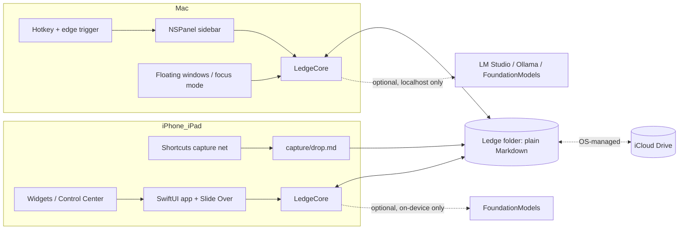

# Ledge: ADHD-First Sidebar Notepad, Architecture and Spec (v1.1)

> **Correction, 2026-08-17.** The signing and distribution status recorded below is
> out of date. Sections 4.1 to 4.4, the free-provisioning and AltStore findings, and
> the M4 signing note are historical: the maintainer has been on the paid Apple
> Developer Program since 2026-07-27, with one-year provisioning profiles, so there
> is no seven day re-signing and no free-tier constraint on the maintainer's builds.
> The free-tier path is kept only so forkers without a membership can still build
> and sideload. See CLAUDE.md, "Signing and distribution reality". Everything else
> in this document still stands.

Working title: **Ledge** (a note resting on the ledge of your screen). Verify name collisions before public release. Alternates: Sliver, Margin.

| | |
|---|---|
| Status | v1.1: Phase 1 spec plus the Apple Developer Program decision and competitive audit folded in (see companion brief). No app code written. |
| Builder | Claude (Anthropic). Credited openly in README, About screen, and commit trailers. |
| License | MIT (recommended over Apache-2.0: shorter, equally permissive; Apache only adds a patent grant this project does not need). Public GitHub repo. |
| Cost | Zero mandatory cost. The architecture requires nothing paid (Section 4 proves the free path end to end). One optional paid item exists as of v1.1: Apple Developer Program membership (99 USD/yr), recommended for portfolio-wide distribution and the WWDC goal, pending owner confirmation (Section 4.4). Ledge stays free and open source either way. |
| Privacy | Local-only by default. Plain Markdown files. No accounts, no telemetry, no egress. Storage location at rest stated in Section 5.3. |
| Platforms | macOS Tahoe 26 (M4 Pro, co-primary), iPhone (co-primary), iPad (strong secondary). |
| Phase 2 | Build in Claude Code CLI (Opus 4.8, ultrathink). Plan in Section 8. |
| Spec date | v1.0 2026-07-18; v1.1 2026-07-19 (competitive audit additions A1-A7, Developer Program distribution path) |

## 0. Executive summary

Verdict: the app is buildable at zero cost on all three platforms, with one honest asymmetry. On macOS the SnappyNotes-style edge sidebar is fully replicable and improvable with zero permission prompts and zero signing burden. On iPhone and iPad no third-party app can overlay other apps, so the sidebar concept translates to: a Shortcuts-based capture net that never expires (primary capture), a sideloaded native app kept alive by AltStore (full editor), and Slide Over on iPadOS 26.1+ (the closest real sidebar on iPad).

The critical feasibility question resolved in our favor: a free personal team iOS app CAN read and write plain files in a user-picked iCloud Drive folder through the document picker with persisted security-scoped bookmarks. Only Apple's own iCloud container, CloudKit, and push entitlements are paid. So free cross-device sync via plain Markdown files in iCloud Drive works end to end.

The ADHD thesis, from the research: the sidebar form factor is not a convenience, it is the intervention. An always-at-the-edge, hotkey-summoned, single-inbox notepad directly implements Barkley's externalization at the point of performance and defeats out-of-sight-out-of-mind. None of the nine scanned competitors combines that with durable local Markdown, free sync, and a no-shame resurfacing loop. That gap is the product.

What beats SnappyNotes: free and open source, plain files with zero lock-in, a capture path on iPhone that survives certificate expiry, Shortcuts and App Intents automation (SnappyNotes has none), an ADHD-first interaction layer (Sections 2 and 3), and no license servers, accounts, or sync trust issues (their support docs show sync and save reliability as their top pain points).

v1.1 update: a competitive audit against Apple Notes, Drafts, Bear, Obsidian, and SideNotes confirmed Ledge occupies an empty quadrant (edge overlay + plain local Markdown + free + gentle resurfacing; nobody combines them) and contributed eight P1 features (3.3, A1-A8: menu bar mini-capture, Siri phrase, drag-to-edge drop, on-device OCR search, version safety net, capped send-anywhere, capture widgets, and Apple Watch dictation capture, pulled from v2 to P1 by owner decision on 2026-07-19). P0/MVP is deliberately unchanged. The Apple Developer Program recommendation (pay now, portfolio-driven) adds a distribution path in 4.4 without changing one line of the architecture: still plain files, no CloudKit, no push, no accounts.

## 1. Reference teardown: SnappyNotes 2.0.2

Sources: attached screenshot (r/macapps launch post), snappynotes.appverge.net (home, changelog, support FAQ including collapsed answers via JSON-LD, markdown-guide), App Store listing id6745701026, apptorium.com/sidenotes. Full citations in Section 10.

### 1.1 Feature teardown table

Friction value = how much the feature reduces capture friction for an ADHD user.

| Feature | What it does | Implied tech (Apple-native) | Friction value | Notes |
|---|---|---|---|---|
| Edge activation sidebar | Docks hidden at screen edge; reveals on hover, click, or shortcut; shows over full-screen apps; per-monitor edge detection | Non-activating borderless NSPanel, raised window level, canJoinAllSpaces + fullScreenAuxiliary; global mouse monitor for hover | High | Multi-monitor edge detection needed fixes (v1.1.0): inherently fiddly mechanic |
| Gesture open | Marketing says gesture; confirmed reality is hover-dwell or click or hotkey. Two-finger swipe switches notes (2.0.1), not opens | Global NSEvent monitor | High | Hover-dwell needs Accessibility permission; hotkey path does not (see 4.B) |
| Live-preview Markdown | Full Markdown renders as you type; raw syntax visible only on the caret line | TextKit 2 custom NSTextStorage, attribute runs toggled by caret position (Bear / iA Writer pattern), not a web editor | High | iOS build also has a separate Preview/Edit toggle, confusing per reviews |
| Images inline | Drop image, renders in note and in PDF export | NSTextAttachment / attachment view provider; sidecar asset files assumed | High | Storage mechanism unconfirmed |
| KaTeX math | LaTeX renders typeset inline | KaTeX JS (confirmed by name) in WKWebView | Med-High | Niche outside technical notes |
| Flow charts | "Add flow charts" inline | Uncertain: mermaid.js likely, freeform sketch possible | Med | Biggest open question in the teardown; do not assume mermaid |
| Slash command menu | "/" opens insert menu | Native popover anchored to caret rect | High | Removes syntax recall burden |
| Tappable checkboxes | `- [ ]` renders as toggleable control | Attachment-hosted control re-serialized on toggle | High | Checked-state persistence was broken pre-1.2.1 |
| Syntax-highlighted code | Fenced blocks colored by language | Native tokenizer or JS highlighter | Med-High | Added in 1.2.0, not day one |
| Focus mode | One shortcut turns the display into a private notepad, "blocks" other apps and notifications | Full-screen NSWindow at high level; notification blocking is visual occlusion, not system suppression | High | Marketing simplification; SideNotes has no equivalent |
| Floating window | Pop a note out of the sidebar | Standard activating NSWindow sharing the same text storage | High | |
| Open .md from Finder | Open With, plus separate in-app Import (copy) | UTType declaration + NSDocument / FileDocument | Med-High | Interop, not capture |
| PDF export | Math, diagrams, tables, images export exactly as in editor | Render to HTML in offscreen WKWebView, createPDF | High value | SideNotes exports image only |
| Autosave | "Every keystroke", no save button | Debounced disk writes (dev's own review reply: wait a few seconds) | High | 2025 reviews report notes failing to save; pre-2.0, may be fixed |
| iCloud sync + offline copy | Notes in iCloud Drive, local copy per device, one Apple ID | iCloud Drive documents (ubiquity container), not CloudKit; FAQ language is Drive-specific | High when working | Dedicated troubleshooting FAQ and crash history (1.0.5): their weakest point |
| License, 5 devices | 9.99 EUR one-time, web license, sign-in to activate; App Store shows Free | Custom license backend outside StoreKit | None (negative) | A whole problem class we delete by being free |
| macOS 15+ / iOS 16+, 10 MB Mac and 14.4 MB iOS | Modern floor, tiny binary | Rules out Electron; native Swift + selective WKWebView confirmed by size | Baseline | Speed is load-bearing for the whole pitch |

### 1.2 Surfaces inventory

Confirmed: edge sidebar panel; floating note windows; focus-mode full-screen takeover; settings (width, text size, frontmost behavior, hover vs click, closing behavior); About with license sign-out; in-app changelog popup; Finder-visible notes folder; slash menu; iOS app (opens into a note, swipe between notes, swipe-past-last creates new, Preview/Edit toggle, H1-H3 toolbar, welcome guide); PDF export. Assumed: menu bar item (changelog implies a hidden background access point). Confirmed absent on iOS: widgets, share extension, keyboard extension, any quick-capture surface.

### 1.3 SideNotes contrast (interaction model reference only)

SideNotes (Apptorium, 19.99 USD Mac + separate mobile product, macOS 13+): many notes stacked in the sidebar, folders, colors, themes, Shortcuts + AppleScript + URL scheme automation, share extension, image export. SnappyNotes deliberately simplified to one note in focus, no folders, no automation, one cheap license. Ledge takes SnappyNotes' focus model and SideNotes' automation openness, and drops both of their pricing/licensing machinery.

### 1.4 Weaknesses to exploit

Sync reliability is their documented top support topic; save reliability is their worst review; iOS has zero quick-capture surface (no widget, no share extension) and is openly a companion app; no automation of any kind; closed source; license and device-cap chores; macOS 15+ floor. Ledge answers each structurally: plain files (no opaque sync layer), append-only capture spool (Section 5.4), Shortcuts-first iPhone capture, App Intents everywhere, MIT source, no license anything.

## 2. Design system

### 2.1 Extracted SnappyNotes tokens (source: compiled site CSS, triple-checked against Firecrawl branding scan and markup classes; all hex from-site-css, none estimated)

Site stack: Next.js + Tailwind 3.4, shadcn-style CSS variables. Fonts: Geist (body, 400/500/600) and Geist Mono (headings, nav, labels, price), self-hosted. Headings literally prefixed with "#" / "##" in the rose accent, echoing Markdown.

| Token | Role | Light | Dark |
|---|---|---|---|
| background | page | #F7F5F2 | #1C1B1D |
| surface / card | elevated panel | #FCFBF8 | #28272A |
| surface-2 / muted | chip, subtle panel | #F0ECE5 | #211F23 |
| foreground | primary text | #1C1B1D | #F7F5F2 |
| muted-foreground | secondary text | #6D6774 | #C4C6CA |
| border / input | hairlines | #E3DDE1 | #383638 |
| rose (primary = accent = destructive, one hue for all three) | brand accent, focus ring, error | #BD4753 | #E78892 |
| rose-hover | hover | #A33843 | #EFA9B0 |
| sage | status dot, one syntax highlight | #367B23 | #A0D392 |
| gold | price emphasis | #C28A0F | #E8B13B |

Fixed "pad" tokens (app mockups, footer, CTA are always dark regardless of site theme): pad-bg #1C1B1D, pad-surface #28272A, pad-heading #F7F5F2, pad-rose #E78892, pad-text #C4C6CA, pad-line #383638. Type: body 16px; fluid clamp() headings up to 80px; line-height 1.05 headings / 1.5-1.65 body; tracking -0.02em to -0.04em on headings. Spacing: 4px base grid, 1120px content width, 68px sticky frosted header (80% bg + 24px blur). Radii: 6px controls, 9-10px buttons, 14-18px frames, full pills. Shadows: minimal; one soft 0 30px 60px rgba(0,0,0,.4) under the hero. Buttons: flat, no shadow, mono 15px medium.

Character: calm, airy, text-forward, warm off-white, one desaturated accent doing nearly all color work, Linear/Raycast-style dark device frames. This is a good starting point; it is already 70% of an ADHD-calm palette.

### 2.2 Ledge refined tokens (ADHD-first variant)

Keep: the warm paper base, charcoal dark mode (not pure black), hairline borders, flat buttons, low shadow budget, single-accent discipline. Change: semantics and everything that can read as blame or noise.

| Token | Role | Light | Dark | Change vs SnappyNotes and rationale |
|---|---|---|---|---|
| bg | canvas | #F7F5F2 | #1C1B1D | Kept. Warm off-white kills glare; charcoal avoids OLED smear and harsh contrast |
| surface | panel, cards | #FCFBF8 | #28272A | Kept |
| surface-2 | pills, wells | #F0ECE5 | #211F23 | Kept |
| text | body | #1C1B1D | #F7F5F2 | Kept. ~13:1 contrast where it matters most: the words |
| text-muted | timestamps, meta | #6D6774 | #C4C6CA | Kept. ~4.9:1, AA at meta sizes |
| text-aged | entries drifting toward the Attic | #9B95A1 | #8E8F94 | NEW. Age fades content gently instead of flagging it; the anti-overdue color |
| border | hairlines | #E3DDE1 | #383638 | Kept |
| accent | THE one action color: primary action, focus ring, links, active caret line tint | #BD4753 | #E78892 | Kept hue, narrowed job. One accent = one obvious next action per view |
| accent-hover | | #A33843 | #EFA9B0 | Kept |
| done | checked boxes, capture-confirmed flick, success | #367B23 | #A0D392 | NEW ROLE. SnappyNotes barely uses its sage; we make it the trust color: saved, captured, done |
| attention | sync conflict, genuine data issues only | #C28A0F | #E8B13B | NEW ROLE. Amber, in-surface, sentence-case text. Never a badge, never a count |
| destructive | none | none | none | REMOVED as a color. No red states anywhere (RSD principle, 3.1 P9). Archive replaces delete; rare true deletes use plain text + confirm |
| selection | text selection | accent at 18% | accent at 24% | Calm, on-brand |

Typography: system fonts, not Geist. SF Pro Text for UI and notes (editor body 15px at 1.6 line height), SF Mono 13px for code, New York optional as a reader serif toggle. Rationale: zero load time, native rendering on every surface including free-provisioned iOS, Dynamic Type support for free, and fewer moving parts. SnappyNotes' mono-heading Markdown cosplay is charming marketing but adds visual noise in an actual editor; in-app headings are SF Pro semibold (H1 22, H2 18, H3 15). If brand parity is ever wanted, Geist is OFL-licensed and can be bundled free. Timestamps: 11px text-muted, relative ("25 min ago"), absolute on hover.

Layout and motion: 4px grid; sidebar default 380px wide, min 320, max 520; 20px content padding; 24px between day groups; radii 12px panel, 6px controls; one soft shadow on the panel only (0 8px 40px rgba(0,0,0,0.18)). Slide-in 160ms ease-out; every animation honors Reduce Motion by degrading to a 100ms fade. Focus ring: 2px accent, keyboard navigation only.

Rules that are tokens in spirit: one primary action per view; no toolbar by default (slash menu and command palette carry everything); nothing blinks, bounces, or counts at you; empty states are one quiet sentence, not illustrations with advice.

Both themes ship day one; follow system by default. Contrast targets: body text AAA, meta text AA minimum, verify programmatically in Phase 2 CI.

## 3. ADHD-first improvement layer (the differentiator)

Full research with citations in Section 10.3. ADHD-C is the design constraint; every choice below is justified against: reduce friction (F), reduce decisions (D), prevent loss (L), avoid overwhelm (O), effortless refind (R), gentle nudge (N).

### 3.1 Principles (each grounded in a documented trait)

| # | Principle | Trait it answers | Design consequence |
|---|---|---|---|
| P1 | Capture must outrun working memory: under ~1s from thought to blinking cursor | WM deficits near-universal in ADHD (Kasper 2012, Martinussen 2005) | Resident process, preloaded panel, no launch screen, no sync gate |
| P2 | Zero decisions at capture | Decision fatigue, analysis paralysis (ADDitude) | No title, folder, tag, or template questions, ever |
| P3 | Live in sight, at the point of performance | Out of sight out of mind; Barkley's externalization at the point of performance | Edge presence, menu bar residue, widgets; a docked icon is a graveyard door |
| P4 | Time-anchor everything automatically | Time blindness (Weissenberger 2021, Ptacek 2019); impaired prospective memory (Fuermaier 2013) | Auto timestamps, relative time display, browse-by-time |
| P5 | Zero maintenance to stay healthy | Strategy knowledge is intact, persistence is not (Durand 2020, n=774) | Day one usability after two weeks of neglect; nothing accumulates into guilt |
| P6 | Work with the interest-based nervous system | Dopamine-gated motivation (Dodson; Volkow 2010) | Core loop fast, tactile, typographically pleasing; novelty at the periphery (themes), never required |
| P7 | Never interrupt hyperfocus, soften re-entry | Hyperfocus (Hupfeld 2019, Ashinoff 2021) | Never steals focus, no modals; perfect state restoration; hyperfocus breadcrumb |
| P8 | Nudge without nagging | Alert fatigue; identical alerts go cognitively invisible | Resurfacing is pull, in-surface, at user-chosen moments; notifications single-shot only |
| P9 | The interface must be incapable of scolding | Rejection sensitive dysphoria (Dodson, Cleveland Clinic) | No red, no overdue counts, no streaks, no guilt copy; unfinished = open loop, not failure |
| P10 | Intention-to-action gap near zero | Task initiation friction (CHADD, Brown's activation cluster) | One gesture resumes exactly where you left off, cursor mid-word |
| P11 | Prevent note graveyards structurally | Doom piles (ADDitude); 400 stale notes make the app aversive | Working set stays small automatically; age tucks entries away reversibly (the Attic) |
| P12 | Search for vague, episodic memory; capture context for future-you | Refinding failure ("I know I wrote it somewhere"); notes that later make zero sense | Fuzzy, typo-tolerant, recency-weighted search; auto source breadcrumbs; capture confirmation so the brain releases the thought (Masicampo and Baumeister 2011) |

### 3.2 What the field scan says (why apps stick or die for ADHD)

Stick factors, recurring across Drafts, Antinote, Tot, Heynote, Keep, Obsidian daily notes, Llama Life, Twos: summon-to-typing in about a second; one predictable landing place with zero filing; time does the organizing; always visible or one reflex away; forgiving after absence; tactile small wins without gamification. Abandonment mechanisms (the app graveyard): setup-as-dopamine then collapse, accumulated guilt (overdue, streaks, backlogs), capture friction creep, the app falling out of sight, refinding failure ending trust, novelty decay. Drafts proves the inbox model; Tot proves constraint; Antinote proves instant summon and disposability; all three miss durable-plus-synced-plus-gentle in one tool.

### 3.3 Prioritized feature list

P0 = MVP, P1 = v1.x, P2 = later. Tests in parentheses.

| # | Pri | Feature | Behavior it serves |
|---|---|---|---|
| 1 | P0 | Instant summon: global hotkey + edge trigger, resident process, target under 150ms to blinking cursor, works over full-screen apps, never a spinner (F, L) | The thought survives the reach. Faster than SnappyNotes is the headline metric |
| 2 | P0 | One default Inbox: every summon lands in inbox.md, cursor on a fresh entry; other notes exist but capture never asks (D, F, L) | Deletes the where-does-this-go decision that kills capture |
| 3 | P0 | Auto entry timestamps, stored as plain Markdown headings, rendered as relative time (L, R) | Time bookkeeping the user will never do |
| 4 | P0 | Day headers, newest at top: Today, Yesterday, Tue 14 Jul; new entries prepend at eye level (O, R, D) | Scrolling is time travel; zero manual organization to fall behind on |
| 5 | P0 | Capture confirmation flick: on dismiss, the entry visibly tucks toward the edge, done-color tick, haptic on iOS (L, F) | The signal that lets the brain release the thought (Masicampo effect) |
| 6 | P0 | Esc is the only ceremony: same hotkey or Esc dismisses; autosave every pause; no save, no dialogs, no unsaved-changes anywhere (F, D) | Zero exit cost = zero entry hesitation |
| 7 | P0 | Zero chrome default: no toolbar; slash menu + command palette carry all commands; minimal mode is not a mode, it is the default (O, F) | Chrome is micro-decisions; SnappyNotes is toolbar-light, Ledge is chrome-zero |
| 8 | P0 | Flat structure: single recency-sorted note list, up to 3 pins, no folders at all; inline #tags indexed but never required (D, O, R) | Nothing can be lost in a tree that does not exist |
| 9 | P0 | Vague-memory search: fuzzy, typo-tolerant, recency- and frequency-weighted, natural time filters ("last week"), snippets with timestamps (R, O) | Built for "I know I wrote it down somewhere" |
| 10 | P0 | Perfect state restoration: note, scroll, cursor, selection, mid-word (F, L) | Hyperfocus re-entry and task initiation both land on a warm engine |
| 11 | P0 | Onboarding is a note: first launch opens the inbox pre-seeded with one editable tutorial entry; no tour, no permission wall, no account (there are none) (F, O) | Setup is where ADHD apps die first |
| 12 | P1 | Open Loops view: one command aggregates every unchecked checkbox across notes, grouped by age, each jumping to source; pull not push, no badge, no count on any icon; optional one daily soft prompt, neutral wording (L, N, O) | Unfinished things resurface without shame |
| 13 | P1 | End-of-day sweep: optional ritual at a chosen hour; sidebar shows today's captures + open loops; single keys triage: keep / done / let go (archive, judgment-free); skippable forever without nagging (N, L, O) | The brain sweep, structurally gentle |
| 14 | P1 | The Attic: entries untouched ~30 days auto-tuck into a searchable archive; working surface stays permanently short; nothing deleted, everything one search away (O, L) | Tot's constraint and Antinote's disposability without their data loss |
| 15 | P1 | Context breadcrumb: capture triggered with a selection or clipboard auto-appends one line of source (frontmost app, URL, file); local-only (L, R, F) | Fixes notes that later make zero sense |
| 16 | P1 | Hyperfocus breadcrumb: one hotkey drops a timestamped "was doing / next step" entry before a rabbit hole; surfaces in Open Loops (L, F) | Softens the hyperfocus crash landing |
| 17 | P1 | Inline visible timer: /timer 15 embeds a live countdown in the note next to the thing it times; gentle chime, overtime counts up, never alarms (F, N) | Llama Life's mechanism without the subscription |
| 18 | P1 | Dictation-first mobile capture: Action Button / lock screen arm the mic, transcript lands timestamped in the inbox (F, L) | Racing thought beats typing on glass |
| 19 | P1 | Share sheet capture: send anything to the inbox without opening UI; explicit paste and drag only. The v1.0 opt-in clipboard watcher is withdrawn per the v1.1 audit: surprise ingestion into a permanent inbox is a privacy and noise hazard (F, L) | Capture from inside any app |
| 20 | P1 | Focus mode: single shortcut, full display becomes the note, typewriter scroll, current entry gently highlighted (O, F) | Parity with SnappyNotes plus calm |
| 21 | P2 | One-shot gentle reminders: "remind me tomorrow 9am" inline creates a single local notification, fires once, then lives in Open Loops; varied wording to resist alert blindness (N, L) | Nudges that stay visible to the brain |
| 22 | P2 | Session presence (flagged speculative): optional ambient strip with elapsed time and the line you said you are working on; a body-double stub, local, non-social (Eagle et al. on body doubling); validate demand first (F, N) | Initiation aid, not a feature checkbox |
| 23 | P2 | Theme packs and capture sounds: the contained novelty budget (P6); browse-by-time timeline across all notes for episodic refind (R) | Novelty at the periphery |
| A1 | P1 | v1.1: Menu bar mini-capture popover on Mac, a compact field into the same inbox, for second displays and moments the full panel feels heavy (F, L) | Drafts' most-loved Mac affordance, Bear's most-begged gap |
| A2 | P1 | v1.1: Siri capture phrase via App Intents: "Add to Ledge" prompts for text hands-free, appends timestamped (F, L) | Voice dump while cooking, driving, walking; rides the existing App Intents work |
| A3 | P1 | v1.1: Drag-to-edge drop capture: text, URLs, images dropped on the collapsed edge tab append to the inbox with a source breadcrumb (F, D, L) | SideNotes' beloved drop target; Ledge already owns the edge |
| A4 | P1 | v1.1: Vision OCR: text inside dropped or pasted images is extracted on-device and indexed for search; /ocr converts an image to text in place (R, L) | Bear paywalls this, Apple Notes buries it in a proprietary pile; ours is free, local, in plain files |
| A5 | P1 | v1.1: NSFileVersion safety net: silent snapshots before sweeps, Attic moves, and spool drains; per-note restore. Honest limit: versions are per-device, iCloud does not sync them (L) | Loss anxiety is a capture killer; Drafts and Obsidian both prove the value |
| A6 | P1 | v1.1: Send-anywhere, capped: per-entry share sheet, copy as Markdown, one-shot handoff to Apple Reminders; no user scripting, no action store (F) | Drafts' soul without Drafts' documented overwhelm |
| A7 | P1 | v1.1: Native capture widgets: lock screen, Home Screen, Control Center control opening straight to the inbox keyboard (F, L) | Every rival with good mobile capture ships these; complements the Shortcuts net |
| A8 | P1 | v1.1, pulled from v2 to P1 by owner decision 2026-07-19: Apple Watch dictation capture as a native watch app; entries relay via WatchConnectivity to the iPhone app, which appends them to the inbox (the watch cannot reach the iCloud Drive folder itself, and the Shortcuts route is verified broken on watchOS); offline captures queue on-wrist until the phone is reachable (F, L) | The most-loved Drafts feature; committed as milestone M4W |

Deliberately absent despite being common asks: backlinks, graph views, AI that auto-moves notes (unpredictable locations break refind trust), multi-vault workspaces. They add decisions and maintenance, the two documented killers. The v1.1 audit adds to the rejected list, each failing a test: locked or encrypted notes (lockable states contradict zero-decision capture; FileVault plus Advanced Data Protection cover the threat model), user template galleries (a pre-capture decision), web clipper extensions (a second product surface with permanent maintenance), nested tags (hierarchy is a taxonomy decision engine), collaboration (requires accounts), clipboard auto-capture (privacy and noise hazard), recurring reminders engine (the nagging machine; one-shot plus Open Loops stay). Full reasoning in the companion audit brief.

### 3.4 Anti-features (hard bans)

1. Unread badges and red dots: every red dot is a guilt token that trains avoidance. 2. Streaks: one missed day converts motivation into proof of failure. 3. Gamification economies: borrowed dopamine that decays and makes the core loop feel like a chore. 4. Recurring notification nagging: identical repeats go cognitively invisible, then everything gets disabled. 5. Setup wizards and template galleries: setup is a dopamine substitute for use and future maintenance debt. 6. Folder trees: filing decisions at capture time plus places to lose notes forever. 7. Forced categorization at capture: any question between thought and text kills the capture. 8. Persistent toolbars: persistent visual options are persistent micro-decisions. 9. Upsells, trial countdowns, donation interrupts: an interruption at capture time is a lost thought; keep even donation asks out of the capture path. 10. Overdue states and failure counters: age fades toward the Attic, never turns red. 11. Productivity report cards: self-comparison dashboards are shame generators. 12. Sync spinners or account gates anywhere near the editor: local file first, always; one eaten thought ends trust permanently.

## 4. Zero-cost distribution and runtime (the highest-risk decision, resolved)

All findings verified against 2025-2026 sources by dedicated research; citations in Section 10.2. Anything not confirmable is marked UNVERIFIED. Paid dependencies found and replaced: Apple Developer Program 99 USD/yr (replaced by free personal team + Shortcuts + AltStore), CloudKit/iCloud container/push entitlements (paid tier only; replaced by document-picker folder access), TestFlight and App Store distribution (paid; replaced by GitHub Releases + build-from-source), Developer ID notarization for frictionless Mac sharing (paid; replaced by Open Anyway / xattr instructions for other users).

### 4.1 Verified findings

| # | Question | Finding | Status |
|---|---|---|---|
| A | Run own app on own Mac, free | Free Xcode, Sign to Run Locally (ad hoc): no certificate embedded, nothing expires, runs indefinitely. Sharing with others: Sequoia removed right-click-open bypass; users use System Settings > Privacy & Security > Open Anyway (once per version) or `xattr -d com.apple.quarantine`; unchanged in Tahoe | VERIFIED |
| B | Sidebar overlay + hotkey permissions on macOS | Non-activating NSPanel (.nonactivatingPanel, .canJoinAllSpaces, .fullScreenAuxiliary) needs no permission. Carbon RegisterEventHotKey needs no permission (deprecated but stable, used by VS Code, Slack). NSEvent global monitors need Accessibility; CGEventTap needs Input Monitoring. Consequence: hotkey + click activation ships permission-free; hover-dwell edge activation is an optional extra that costs one Accessibility grant | VERIFIED |
| C | iOS free provisioning limits | 7-day profile validity, 3 sideloaded apps max, 10 App IDs per rolling 7 days, cable first then Wi-Fi deploy, app hard-stops on expiry but data persists across re-signs. Personal teams lack: iCloud (all three types), push, Sign in with Apple, associated domains, and more. Personal teams DO get: App Groups (commonly misreported), background modes, keychain sharing; WidgetKit widgets and iOS 18 Control Center controls are not capability-gated | VERIFIED |
| D | AltStore | AltStore Classic: worldwide (no UAE blocker found), free Apple ID, AltServer on the Mac auto-refreshes the 7-day profile over shared Wi-Fi, 3-app cap, mature in 2026. SideStore exists but is fragile (VPN companion app removals). AltStore Classic 2.3 beta adds on-device refresh | VERIFIED |
| E | THE LINCHPIN: free app + iCloud Drive files | YES. UIDocumentPickerViewController folder pick grants recursive read-write to an iCloud Drive folder, persisted via security-scoped bookmark, coordinated via NSFileCoordinator. This is not an entitlement personal teams lack; it is not in the capability table at all. iCloud Drive is always offered in the folder picker. Real-world proof: KOReader iOS documents exactly this split on a free team. Caveats: dataless placeholders download on coordinated read; users can revoke in Settings; bookmark survives re-sign with same team + bundle ID | VERIFIED |
| F | PWA fallback on iOS 26 | Home screen web apps: service workers, offline, exempt from 7-day eviction, push since 16.4, same 60%-of-disk quota. But: no File System Access API in Safari, OPFS is origin-private, no Web Share Target. A PWA can never touch the iCloud Drive notes folder, so it fails our sync architecture. Rejected as anything but a last-resort viewer | VERIFIED |
| G | iPad sidebar reality | iPadOS 26.0 removed Slide Over and Split View for the new windowing system; Slide Over RETURNED in iPadOS 26.1 (Nov 3, 2025): one resizable Slide Over app, hideable off the screen edge. No API can force an app into Slide Over; the user places it there once | VERIFIED |
| H | iPhone overlay honesty | No third-party iOS app can draw over other apps, period (no SYSTEM_ALERT_WINDOW equivalent; PiP is video-only). Real capture surfaces: Action Button (15 Pro+), Control Center Shortcut control (iOS 18+), lock screen Shortcuts widgets, Back Tap, Share Sheet. Every one of these works Shortcuts-only, with zero apps installed | VERIFIED |
| I | Shortcuts capture net | Append to Text File action appends typed/dictated/shared text (with date variables) to a .md file in iCloud Drive, creates the file if missing, triggerable from all surfaces in H. One-time folder grant prompt for non-Shortcuts folders. iOS 26 changes: none found (negative UNVERIFIED) | VERIFIED |
| J | On-device Apple AI | FoundationModels framework: iOS/iPadOS/macOS 26+, Apple Intelligence devices (iPhone 15 Pro+, M1+ iPads/Macs). Base on-device SystemLanguageModel requires no entitlement; only custom adapters and Private Cloud Compute need paid entitlements. Free personal team usability is a strong inference, not an Apple quote | VERIFIED (last point: inference) |
| K | Repo + CI | GitHub public repos free; Actions standard macOS runners unmetered on public repos | VERIFIED |

### 4.2 Recommendation

| Device | Primary | Fallback |
|---|---|---|
| Mac | Native SwiftUI app, free Xcode, ad hoc signed, launch-at-login resident. Permanent, zero prompts, zero expiry | Rebuild in minutes; for other users: GitHub Releases + Open Anyway/xattr note, or build from source |
| iPhone capture | Shortcuts capture net: one shortcut (text or dictation, timestamp, Append to Text File into the notes folder spool) bound to Action Button, Back Tap, lock screen, Control Center, Share Sheet. Zero apps, zero signing, never expires | This IS the safety net; degrades only if iCloud Drive itself is down (append fails visibly) |
| iPhone full editor | Native SwiftUI app sideloaded via free personal team, folder access per finding E, kept alive by AltStore auto-refresh from AltServer on the M4 Pro | Weekly manual Xcode Wi-Fi re-deploy; PWA viewer as last resort (cannot write the folder) |
| iPad | Same sideloaded app, parked in Slide Over (iPadOS 26.1+) as a true edge sidebar over any app, or tiled narrow window | Shortcuts net (same shortcut syncs via iCloud) |

The honest statement: the always-available edge overlay exists only on macOS. On iPhone it is approximated by system surfaces (Action Button and friends), which is genuinely fine for ADHD capture because those are faster than any app switch. On iPad, Slide Over is a real, user-parked sidebar. Design consequence, non-negotiable: the iPhone capture path must be signing-independent. When the sideloaded app's 7-day profile lapses mid-travel, capture must not break; Shortcuts guarantees that. The app is the nice-to-have layer; the capture net is the product promise.

Architecture consequence: no CloudKit, no ubiquity container, no push, anywhere. Plain files in one user-visible iCloud Drive folder, NSFileCoordinator on iOS, FSEvents + coordinated writes on Mac.

### 4.3 Burden table

| Path | One-time setup | Recurring | Breakage risk | Capture when broken |
|---|---|---|---|---|
| Mac native, free Xcode | Low: install Xcode, build, add login item | None | Very low (rebuild after major macOS updates at worst) | n/a, rebuild in minutes |
| iPhone/iPad via Xcode personal team | Medium: Developer Mode, cable pairing once | Re-deploy every 7 days (Wi-Fi) | High if traveling or forgetful; app hard-stops day 7, data safe | Zero until re-signed; Shortcuts net still captures |
| iPhone/iPad via AltStore Classic | Medium: AltServer on Mac, app-specific password, sideload | Mostly none (background Wi-Fi refresh); occasional manual tap | Medium: Mac asleep/away past day 7; 3-app cap | Zero while expired; Shortcuts net still captures |
| Shortcuts net (no app) | Very low: import one shipped .shortcut, bind triggers | None | Very low (system feature) | This is the fallback |
| PWA viewer | Low: GitHub Pages, Add to Home Screen | None | Low | Read-only mirror at best, never the notes folder |

### 4.4 Distribution with the Apple Developer Program (v1.1, pending owner confirmation)

The companion decision brief recommends buying membership now (99 USD/yr), driven by the portfolio (Helios's HealthKit background delivery and weekly re-sign pain, Zest's public Mac distribution, the 3-app sideload cap binding across apps) and the WWDC 2027/2028 goal (the in-person lottery is open only to current members; UAE has no alternative iOS distribution path).

What changes for Ledge if confirmed: development signing lasts 1 year instead of 7 days, so the AltStore refresh machinery becomes unnecessary for the owner; iOS ships to the App Store (free app, no costs beyond membership, privacy labels all "data not collected"); TestFlight (100 internal, 10,000 external testers) replaces ad hoc beta sharing; Mac releases get Developer ID plus notarization, so GitHub downloaders skip the Gatekeeper dance entirely.

What does not change, deliberately: plain Markdown files in a user-visible iCloud Drive folder remain the only sync (CloudKit and the app-owned ubiquity container stay rejected even though membership would unlock them; the user-visible folder IS the product and the zero-lock-in guarantee). No push, no accounts, no telemetry, still. The Shortcuts capture net ships regardless: it is a resilience feature, not a signing workaround. And the entire Section 4.1-4.3 free-tier path stays documented in the README so contributors and forkers without membership can build, run, and sideload Ledge forever. Membership lapse consequence: App Store listings come down, installed apps keep working, notarized Mac builds stay valid (stapled tickets persist).

## 5. Tech stack and architecture

### 5.1 Decisions

| Layer | Decision | Why (and what was rejected) |
|---|---|---|
| Language/UI | Swift + SwiftUI, AppKit where the panel needs it, UIKit interop on iOS | Native = the 150ms summon budget, 10MB-class binary (SnappyNotes proves it), App Intents, FoundationModels, zero runtime deps. Rejected: Electron (size, latency), Tauri 2 (iOS story + NSPanel control immature), PWA (finding F) |
| Shared core | LedgeCore Swift Package: models, Markdown parse/serialize, storage + coordination, search index, resurfacing engine | One tested core, three thin shells (Mac panel, iOS app, widgets) |
| Editor | TextKit 2 with custom NSTextContentStorage: live-preview attributes, caret-line raw syntax, checkbox attachments | The Bear/iA pattern from the teardown; native IME, latency, spellcheck. Rejected: CodeMirror in WKWebView |
| Math/diagrams/PDF | Offline-bundled KaTeX and mermaid in an offscreen WKWebView, render-on-demand for preview blocks and PDF export (createPDF). No CDN calls ever | Selective web rendering is how SnappyNotes stays at 10MB; bundling keeps it offline and egress-free |
| Storage format | Plain Markdown files, one folder, no database as source of truth. Derived index cache (SQLite or JSON) rebuilt from files at any time | Zero lock-in: the notes outlive the app and open in anything. The cache is disposable |
| Sync | iCloud Drive folder (Apple moves the bytes). Mac: direct file I/O + FSEvents. iOS: document-picker bookmark + NSFileCoordinator + NSFilePresenter | Free, no server, no account beyond the Apple ID already on the devices |
| Hotkey/panel | RegisterEventHotKey + non-activating NSPanel (finding B); optional hover-edge via Accessibility grant, off by default | Permission-free default install |
| Automation | App Intents on both platforms: Capture Note, Open Inbox, Append With Context, Start Timer | Powers Action Button, Control Center, Spotlight, and the Shortcuts net; SnappyNotes has none of this |
| Local AI | Strictly optional adapter (Section 6), localhost only, feature-flagged off | Never a dependency |
| Safety and refind (v1.1) | NSFileVersion snapshots before sweeps, Attic moves, spool drains; Vision framework OCR indexing of image text | Both on-device, zero cost, no new dependencies; OCR text lives in the disposable index, files stay pure Markdown |

### 5.2 File format (the contract everything shares)

```
Ledge/                          <- the notes folder, user-visible
  inbox.md                      <- THE capture target, newest day first
  notes/
    2026-07-18-globe-workshop.md
    ...                         <- flat, filename = date + first-line slug (stable after creation)
  attic/                        <- aged entries and archived notes (plain md, searchable)
  assets/                       <- pasted images: 2026-07-18-093214.png
  .ledge/                       <- disposable machine state (index cache, settings), regenerable
  capture/
    drop.md                     <- Shortcuts spool: appended by phone, drained by apps
```

inbox.md structure, pure CommonMark, readable in any editor:

```
## 2026-07-18
### 09:42
Idea about the Globe workshop pricing...

### 08:15
Call Ishan re: renewal handoff
```

Entry = a `###` HH:MM heading under a `##` date heading. Apps prepend new entries (newest at eye level). Shortcuts can only append to file ends, so the phone appends to capture/drop.md instead; every app launch/foreground drains the spool into inbox.md with a coordinated read-then-truncate. Single-writer principle: each file has exactly one primary writer class (apps own inbox.md, Shortcuts own drop.md), which structurally avoids most iCloud conflicts. When iCloud still produces a conflict version, LedgeCore merges at entry level (entries are timestamped and append-ish, so union-merge is safe) and surfaces one calm amber line, never a dialog.

### 5.3 Storage location at rest (stated plainly)

Mac: `~/Library/Mobile Documents/com~apple~CloudDocs/Ledge/` when sync is on, or any local folder (default `~/Documents/Ledge/`) for local-only mode. iOS/iPadOS: the same iCloud Drive folder via persisted security-scoped bookmark; app-private cache lives in the app sandbox. Nothing else, nowhere else. No telemetry, no analytics, no accounts, no network calls except iCloud's own file sync performed by the OS. Note honestly: standard iCloud Drive is encrypted in transit and at rest but Apple holds keys unless the user enables Advanced Data Protection; recommend enabling Advanced Data Protection in the README, and local-only mode exists for zero cloud presence.

### 5.4 Component architecture

In words: three thin shells (Mac panel app, iOS/iPadOS app, Shortcuts/App Intents surface) all talk to one shared LedgeCore package. LedgeCore owns parsing, the derived search index, the resurfacing engine (Open Loops, Attic aging, sweep), and coordinated file I/O against a single plain-Markdown folder. iCloud Drive, run by the OS, is the only sync transport. The optional AI adapter is a leaf node speaking OpenAI-wire to localhost or FoundationModels on-device, and the app is fully functional with it absent.



## 6. Optional local AI layer (never a dependency)

Ground rules: off by default, feature-flagged, degrades to nothing, localhost or on-device only, no cloud API ever, suggestions only (AI never moves, renames, or rewrites a note silently; refind trust depends on predictable locations, per 3.3).

Per the apple-mac-specialist skill (local-ai-tooling reference): on the 48GB M4 Pro, 7B to 13B Q4 models run comfortably with Chrome and Slack open; prefer MLX builds in LM Studio; watch memory pressure and swap before long runs.

| Slot | Recommendation | Why |
|---|---|---|
| Mac serving stack | LM Studio (already installed) exposing OpenAI-compatible localhost:1234; Ollama as drop-in alternative (same wire, swap base URL) | Zero new infra; Ledge speaks one tiny OpenAI-wire client to a configurable localhost URL |
| Default model | Qwen3-4B-Instruct (MLX 4-bit, ~2.5GB) | Auto-tag, checklist extraction, and short summaries are small-model tasks; instant load, negligible memory pressure alongside real work |
| Quality tier | Qwen3-14B or similar 13B-class MLX Q4, loaded only when the Mac is otherwise idle (skill's local_llm_readiness check applies) | Long-note summaries and semantic rerank of search results |
| iPhone/iPad | FoundationModels on-device model where the device supports Apple Intelligence; otherwise no AI, and nothing is missed functionally | Free, on-device, no serving stack; personal-team usability is strong inference (finding J), so treat as bonus, not plan |
| M1 home server (optional) | Existing Ollama on the M1 over Tailscale as a third endpoint | Still user-controlled hardware; document that this leaves localhost, keep off by default |

Features gated behind the flag, all suggestion-shaped: suggest 1-3 inline #tags for an entry (one keystroke to accept); summarize a long note into 3 lines; turn a brain-dump entry into a checklist draft shown side by side; "find that note" natural-language rerank over the top 50 fuzzy-search hits. Each runs on explicit invocation only, never in the capture path (P1: nothing may ever sit between thought and cursor).

## 7. Bill of materials: what it needs from us

Everything below is free except item 11, the single optional paid item, which is decision-gated. A missing item here is a build blocker, so this is the complete list.

| # | Prerequisite | Purpose | Cost | When |
|---|---|---|---|---|
| 1 | Xcode 26 (Mac App Store, ~12GB disk + simulators) | Build Mac and iOS apps, free signing | Free | Before Phase 2 M1 |
| 2 | Free Apple ID signed into Xcode (personal team) | iOS device deploys | Free | Before M4 (iOS milestone) |
| 3 | iCloud Drive enabled, ~50MB in the free 5GB tier | Sync transport (notes are text; years fit in megabytes) | Free | M1 |
| 4 | Developer Mode on iPhone and iPad + one USB-C cable pairing per device | First sideload | Free | M4 |
| 5 | AltStore Classic + AltServer on the M4 Pro + Apple ID app-specific password | Auto-refresh the 7-day profile | Free | M4 |
| 6 | GitHub account, public repo, Actions enabled | Hosting, CI on free macOS runners, Releases | Free | M0 |
| 7 | Shipped .shortcut files imported on iPhone/iPad; bind Action Button, Back Tap, lock screen, Control Center, Share Sheet | The capture net | Free | M4 (usable even before any iOS app exists) |
| 8 | One-time iOS folder grant: pick the Ledge folder in the document picker on first app launch | Finding E access | Free | M4 |
| 9 | Optional: LM Studio (installed) + Qwen3-4B MLX download (~2.5GB) | Local AI flag | Free | M6 |
| 10 | Optional: mermaid + KaTeX dist files vendored into the repo (MIT licensed) | Offline math/diagrams | Free | M5 |
| 11 | Optional, v1.1, pending confirmation: Apple Developer Program membership (individual enrollment, identity verification takes days) | 1-year signing, TestFlight, App Store, Developer ID notarization; see 4.4 | 99 USD/yr, the only paid item anywhere in this project | Before M7; enroll early for the WWDC 2027 lottery window |

Never needed by the architecture, at any membership tier: CloudKit, push notifications, any server, any domain, any analytics SDK. Without membership, distribution to others happens via GitHub Releases with a one-paragraph Open Anyway / xattr note and a build-from-source path; that free path stays documented forever regardless of the membership decision (4.4), because contributors and forkers will not have memberships.

Manual steps that cannot be automated and must be done by hand once: Developer Mode toggle, first cable pairing, the iOS folder pick, AltStore install, Shortcut trigger bindings (Action Button and Back Tap are Settings-app-only). Budget 30 minutes total.

## 8. Phase 2 build plan (Claude Code CLI, Opus 4.8, ultrathink)

Milestones follow the behavior-gate discipline: each gate is an observable behavior, not feature completion, and no more than two gates open at once.

| Milestone | Scope | Gate to pass before moving on |
|---|---|---|
| M0 Foundation (day 1) | Repo scaffold, MIT LICENSE, README with Claude attribution, this spec in docs/, tokens.json from Section 2.2, file-format fixtures + LedgeCore parse/serialize with unit tests | CI green on a public macOS runner |
| M1 Mac capture core (MVP) | Resident menu bar app, RegisterEventHotKey, non-activating NSPanel slide-in, inbox.md prepend-entry with timestamp, autosave, Esc dismiss + capture flick, launch at login, light/dark tokens | Summon-to-cursor measured under 150ms; 7 consecutive days where every stray thought went into Ledge, not Apple Notes or scratch files |
| M2 Editor + refind | TextKit 2 live preview (headings, bold, lists, quotes), tappable checkboxes, day grouping newest-first, fuzzy recency-weighted search, perfect state restoration, note list + pins, Attic aging, menu bar mini-capture popover (A1) | 10 straight successful refinds under 10 seconds via search (logged locally); zero manual filing performed all week because none exists |
| M3 Resurfacing | Open Loops view, end-of-day sweep, context breadcrumb, hyperfocus breadcrumb | Sweep used 3+ evenings/week for 2 weeks and described as calm, not dreaded; at least one rescued open loop actually acted on |
| M4 iPhone + iPad | Shortcuts pack shipped (capture, dictation, share sheet), spool drain logic, iOS SwiftUI app (folder bookmark, inbox, note list, search), iPad Slide Over layout pass, Siri capture phrase (A2), capped send-anywhere (A6), capture widgets + Control Center control (A7). Signing: AltStore refresh if free tier, 1-year signing if membership confirmed | 2 weeks of mobile captures landing in inbox.md with zero losses, including one deliberate week with the app unavailable (net must hold) |
| M4W Watch capture (owner-pulled to P1) | watchOS app: one-screen dictation-first capture, WatchConnectivity relay with on-wrist offline queue, complication and Smart Stack entry launching capture | 1 week of wrist captures landing in inbox.md with zero losses, including captures made with the iPhone out of reach |
| M5 Rich layer | Images, KaTeX + mermaid preview blocks (vendored, offline), PDF export via WKWebView, floating windows, focus mode, slash menu, /timer, drag-to-edge drop capture (A3), Vision OCR indexing + /ocr (A4), NSFileVersion safety net (A5) | PDF of a math+diagram+image note matches editor; slash menu used instead of any toolbar request; one deliberate bad sweep fully restored from a version snapshot |
| M6 Optional AI | Localhost adapter, tag suggest, summarize, brain-dump-to-checklist, search rerank; FoundationModels probe on supported devices | Flag stays off by default and the app passes a full M1-M5 regression with AI absent |
| M7 Public release (only if membership confirmed) | Notarized Mac DMG on GitHub Releases, iOS App Store submission (free app, privacy labels all "data not collected"), TestFlight external beta round | App Store approval; first 10 external users capture successfully with zero support pings |

Proposed repo structure:

```
ledge/
  README.md            <- what it is, ADHD thesis, Built by Claude (Anthropic), install paths
  LICENSE              <- MIT
  docs/
    spec.md            <- this document
    file-format.md     <- Section 5.2 as a normative contract
  design/tokens.json
  core/                <- LedgeCore Swift Package (Models, Storage, Markdown, Search, Resurface)
    Tests/             <- fixtures: sample folders, conflict cases, spool drains
  apps/
    mac/Ledge/         <- SwiftUI + AppKit panel shell
    ios/Ledge-iOS/     <- SwiftUI shell (iPhone + iPad targets)
  shortcuts/           <- exported .shortcut files + setup guide with screenshots
  vendor/              <- katex/, mermaid/ (pinned, offline)
  scripts/             <- build, release zip, xattr helper for downloaders
  .github/workflows/ci.yml
```

Build order rationale: Mac first because it is the permanent zero-burden platform and the daily driver; the Shortcuts net ships before the iOS app so mobile capture exists from M4 day one; rich rendering last because none of it is capture-critical.

## 9. Open risks and honest unknowns

1. FoundationModels on a free personal team is a strong inference from entitlement documentation, not an Apple statement (finding J). Probe in M6; nothing depends on it. 2. SnappyNotes' flow-chart syntax is unconfirmed (mermaid assumed); irrelevant to our build but noted for teardown accuracy. 3. Shortcuts action behavior in iOS 26 verified by current docs, but "no changes" is an unverifiable negative; M4 gate tests it empirically. 4. AltStore depends on Apple not tightening free provisioning; the Shortcuts net is the designed hedge, and worst case the editor becomes Mac + any-editor-on-iOS against the same files (plain Markdown means even Files.app or Runestone can edit notes). 5. Hover-edge activation costs an Accessibility grant; shipped off by default, hotkey is the primary summon. 6. "Ledge" name collision unchecked; decide at repo creation. 7. iCloud Drive sync latency is occasionally minutes when devices are cold; the spool design tolerates it, but set expectations in the README. 8. v1.1: App Store review of the pick-a-folder onboarding has no documented rejection precedent (Working Copy ships it), but review is never guaranteed; fallback is an app-local folder with a one-tap move to iCloud Drive. 9. v1.1: membership lapse pulls App Store listings while installed apps keep working; treat 99 USD as recurring while anything is listed. 10. v1.1: Apple Watch capture (M4W) must be a native watch app with a WatchConnectivity relay because the Shortcuts route is verified broken on watchOS (iCloud Drive file access fails there); it is the largest single effort item in v1.x and depends on the iOS app (M4) landing first. 11. v1.1: NSFileVersion snapshots do not sync across devices (verified); never market version history as cross-device.

Phase gate: this document is the Phase 1 deliverable. No application code has been written. Phase 2 begins in Claude Code CLI with M0.

## 10. Sources

### 10.1 Reference app
SnappyNotes: homepage, https://snappynotes.appverge.net/ ; privacy (updated 2026-07-15), /privacy ; terms, /terms ; changelog, /changelog ; support FAQ, /support ; compiled CSS token source, /_next/static/css/79621ad066f4591a.css ; App Store, https://apps.apple.com/app/snappynotes/id6745701026 ; r/macapps launch post (attached screenshot). SideNotes: https://www.apptorium.com/sidenotes and /sidenotes/features.

### 10.2 Distribution and platform (key citations)
Ad hoc signing TN3127, https://developer.apple.com/documentation/technotes/tn3127-inside-code-signing-requirements ; Gatekeeper change, https://developer.apple.com/news/?id=saqachfa and https://support.apple.com/en-us/102445 ; NSPanel nonactivating + fullScreenAuxiliary, developer.apple.com/documentation/appkit ; personal team capability table, https://developer.apple.com/help/account/reference/supported-capabilities-ios/ ; free provisioning limits, https://docs.sidestore.io/docs/faq ; AltStore, https://faq.altstore.io ; document-picker folder access (the linchpin), https://developer.apple.com/documentation/uikit/providing-access-to-directories , real-world free-team proof https://github.com/hezi/koreader-ios ; PWA storage policy, https://webkit.org/blog/14403/updates-to-storage-policy/ ; installed-web-app eviction exemption, https://webkit.org/blog/10218/full-third-party-cookie-blocking-and-more/ ; File System Access absence, https://caniuse.com/native-filesystem-api ; Slide Over removal and 26.1 return, https://9to5mac.com/2025/06/09/psa-ipados-26-removes-split-view-and-slide-over-multitasking-features/ and https://www.macrumors.com/2025/11/03/apple-releases-ipados-26-1/ ; Shortcuts append action, https://matthewcassinelli.com/actions/append-to-text-file/ ; Control Center shortcut control, https://support.apple.com/guide/shortcuts/run-shortcuts-from-control-center-apd06a9201d4/ios ; FoundationModels, https://developer.apple.com/documentation/FoundationModels ; adapter entitlement (paid), https://developer.apple.com/documentation/bundleresources/entitlements/com.apple.developer.foundation-model-adapter ; GitHub Actions billing, https://docs.github.com/en/billing/concepts/product-billing/github-actions.

### 10.3 ADHD research (key citations)
Working memory: Kasper 2012 and Martinussen 2005, https://pubmed.ncbi.nlm.nih.gov/15782085/ ; persistence vs strategy: Durand 2020, https://pmc.ncbi.nlm.nih.gov/articles/PMC7485505/ ; point of performance: Barkley, https://www.russellbarkley.org/factsheets/ADHD_EF_and_SR.pdf ; time blindness: Weissenberger 2021, https://pmc.ncbi.nlm.nih.gov/articles/PMC8293837/ and Ptacek 2019, https://pmc.ncbi.nlm.nih.gov/articles/PMC6556068/ ; prospective memory: Fuermaier 2013, https://pmc.ncbi.nlm.nih.gov/articles/PMC3590133/ ; dopamine motivation: Volkow 2010, https://pubmed.ncbi.nlm.nih.gov/20856250/ ; hyperfocus: Ashinoff and Abu-Akel 2021, https://pubmed.ncbi.nlm.nih.gov/31541305/ ; thought release on externalization: Masicampo and Baumeister 2011, https://pubmed.ncbi.nlm.nih.gov/21688924/ ; alert fatigue review, https://pmc.ncbi.nlm.nih.gov/articles/PMC10983371/ ; RSD: https://www.additudemag.com/rejection-sensitive-dysphoria-adhd-emotional-dysregulation/ and https://my.clevelandclinic.org/health/diseases/24099-rejection-sensitive-dysphoria-rsd ; doom piles: https://www.additudemag.com/doom-piling-adhd-sign-clutter/ ; interest-based nervous system: https://www.additudemag.com/adhd-brain-chemistry-video/ ; body doubling: Eagle et al., https://dl.acm.org/doi/10.1145/3597638.3614486 ; app graveyard and field-scan community threads: r/ADHD, r/adhd_productivity, r/ADHD_Programmers, r/macapps as linked in the research stream (representative: https://www.reddit.com/r/ADHD/comments/13txx4d/a_killer_app_for_adhd_google_keep/ , https://news.ycombinator.com/item?id=38733968 , https://antinote.io/ , https://heynote.com/ , https://llamalife.co/ , https://www.twosapp.com/adhd-app , https://www.iwoszapar.com/p/second-brain-vs-adhd-apps ).

### 10.4 Local AI sizing
apple-mac-specialist skill, references/local-ai-tooling.md (48GB envelope: 7B-13B Q4 comfortable with apps open, 32B when idle; MLX preferred; LM Studio localhost:1234; Ollama localhost:11434).

### 10.5 v1.1 additions (Developer Program + competitive audit)
Full citations live in the companion brief (ledge-adp-decision-and-feature-audit.md). Key: developer.apple.com/support/compare-memberships/ ; developer.apple.com/wwdc26/special-event/ (in-person passes by random selection among members) ; developer.apple.com/swift-student-challenge/eligibility/ (employed adults ineligible) ; support.apple.com/en-us/118110 (no alternative iOS distribution in UAE) ; docs.getdrafts.com (capture window, version history) ; bear.app/faq ; obsidian.md/pricing ; apptorium.com/sidenotes ; developer.apple.com/documentation/vision/recognizing-text-in-images ; eclecticlight.co/2025/05/05/how-document-versions-are-handled-in-icloud-drive/ (versions do not sync).

*Built by Claude (Anthropic). v1.0 2026-07-18, v1.1 2026-07-19.*


